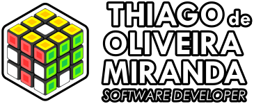

  

    

 

## **:purple_circle: :zap: `Sobre Mim:`**

Analista de sistemas graduado pela faculdade Estácio de Sá. Entusiasta das áreas de tecnologia, artes, design gráfico e 3D. Com foco atual no aprimoramento nas tecnologias de desenvolvimento _Frontend_: **_HTML5, CSS3, Javascript, ReactJS e Angular_**. E _Backend_: **_JAVA e .NET_**. Com aspirações pessoais de empreender estudos com as games engines: **_Unreal, Unity_** e **_Godot_**.

---

### **:purple_circle: :satellite: `Conecte-se comigo:`**

    
    
    

 

---

### **:purple_circle: :computer: `Tecnologias:`**

    
    
    
    
    
    
    
    

---

### **:purple_circle: :dart: `Foco Atual de Estudos:`**

    
    
    

---

### **:purple_circle: :bar_chart: `GitHub Stats:`**

    
    
 

---

### **:purple_circle: :octocat: `Principais Repos:`**

    
   
    
   
    
   
    
   
    
   
    
   
    

 

  

